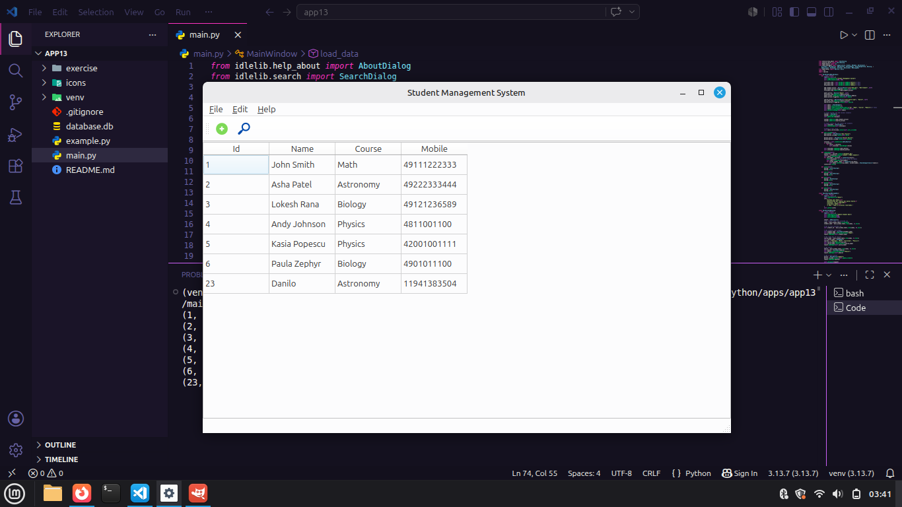

# 🎓 DataSystem App — Sistema de Gerenciamento de Estudantes (PyQt6 + SQLite)


> **DataSystem App** é um aplicativo de gerenciamento de estudantes desenvolvido em Python, utilizando **PyQt6** e integrado a um banco de dados **SQLite (.db)**.  
> O sistema permite **cadastrar, visualizar, editar e remover** estudantes por meio de uma interface gráfica clara e intuitiva, estruturada com **Programação Orientada a Objetos (OOP)**.

---

## 📷 Preview

<p align="center">
  
</p>

---

## 🧠 Sobre o projeto

O **DataSystem App** foi criado com o propósito de simplificar a gestão de informações estudantis.  
A aplicação oferece uma GUI construída em **PyQt6**, conectada a um banco de dados local (`database.db`), onde todas as operações CRUD são realizadas com segurança e rapidez.

---

## 🧩 Estrutura do projeto

```
datasystem-app/
├── icons/            # Ícones utilizados nos botões da toolbar
├── database.db       # Banco de dados externo (SQLite)
├── main.py           # Arquivo principal da aplicação (PyQt6 + OOP)
├── preview.png       # Imagem do app aberto
├── LICENSE           # Licença MIT
└── README.md         # Documentação do projeto
```

---

## ⚙️ Instalação e execução

### 1. Clone o repositório
git clone https://github.com/danilo-santos-python/datasystem-app.git

### 2. Crie um ambiente virtual (opcional)
python -m venv venv

### 3. Instale o PyQt6
pip install pyqt6

### 4. Execute o aplicativo
python main.py

---

## 🔧 Funcionalidades principais

- Cadastrar novos estudantes  
- Editar registros  
- Excluir estudantes  
- Interface com ícones personalizados  
- Banco de dados SQLite externalizado  
- Arquitetura em OOP  

---

## 📜 Licença

Distribuído sob a **Licença MIT**.

Este projeto é open source e pode ser utilizado livremente para fins educacionais e de aprendizado.

---

## 👨‍💻 Autor

**Danilo Santos**  
🐙 GitHub: https://github.com/danilo-santos-python  
🌐 Repositório: https://github.com/danilo-santos-python/datasystem-app


---

⭐ Se este projeto foi útil para você, considere deixar uma estrela no repositório!